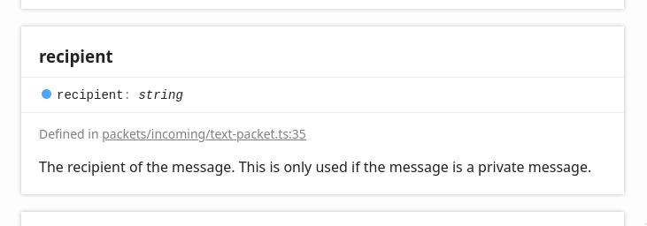

# Adding packet hooks

Now that we have a working plugin we can start adding packet hooks. Packet hooks are methods which will be called whenever a certain packet is received.

The simplest packet hook we can write consists of just the `@PacketHook` decorator, and the type of the packet we would like to hook.

Let's start by creating one of these simple packet hooks for the `MapInfoPacket`. The map info packet is received when a client connects to a new map, so we're guaranteed to receive at least one.

First, we'll need to import the map info packet type.

```ts
// add MapInfoPacket
import { Library, PacketHook, Client, MapInfoPacket } from 'nrelay';
```

Then, we can declare our packet hook method.

```ts
class HelloPlugin {

  @PacketHook()
  onMapInfo(mapInfo: MapInfoPacket) {

  }

}
```

The name of the method and its parameter don't matter, but conventionally they are named "`onSomePacket`" and "`somePacket`" respectively, where `SomePacket` is the type of the packet being hooked.

Before we run our code again, let's add a console log so that we can see it in action.

```ts
class HelloPlugin {

  @PacketHook()
  onMapInfo(mapInfo: MapInfoPacket) {
    console.log('Just received info about: %s!', mapInfo.name);
  }

}
```

Let's build and run our project again to see the plugin in action. This time, we'll add the `--no-update` flag when running our project. Since we've run the project once already, we know the packets are up to date and so we can save some time by not checking for updates.

```bash
$ nrelay build
  ✔ Clean project
  ✔ Build project
$ nrelay run --no-update
[14:35:29 | ResourceManager]  Loaded 1638 tiles.
# ...
[14:35:29 | Main Client]      Connected to Australia!
Just received info about: Nexus!
```

Shortly after we connect to the server we receive a map info packet, and our packet hook is called!

Now that we know the basics of packet hooks, we can get back to the task at hand. The hello plugin needs to respond to the text packet, so we'll modify our packet hook so that it hooks the `TextPacket` instead.

```ts
// change MapInfoPacket to TextPacket
import { Library, PacketHook, Client, TextPacket } from 'nrelay';
```

```ts
class HelloPlugin {

  // change the method name and parameter type.
  @PacketHook()
  onTextPacket(textPacket: TextPacket) {

  }

}
```

Now that our packet hook is set up, we can implement main feature of the hello plugin: responding to direct messages. In order to do this, we need to check whether or not the text packet we received was indeed a direct message, or if it was just a global message. But how do we know what information we have access to?

**Enter: [the packet docs](https://thomas-crane.github.io/realmlib-net/).** These docs are generated from comments in the source code, so they are always up to date and represent all of the information which nrelay packet hooks have access to.

Let's open [the page for the text packet](https://thomas-crane.github.io/realmlib-net/classes/textpacket.html) and scroll down so we can see its properties. Among them, there is one that sticks out as being of particular interest to our current task:



If we receive a private message, then the `recipient` property will contain the name of our bot. So we can simply check this property to see whether or not we have received a private message.

However, this brings up another problem. We could write the following code:

```ts
if (textPacket.recipient === 'OurPlayer') {
  // we got a pm!
}
```

But this is not ideal. The name of our bot, `'OurPlayer'`, is baked into the code. If we ever run this plugin with a different bot, we'll have to change the code too!

To fix this, we'd like to access the player data of the bot which contains the bot's name. But this raises a question: how *do* we access the player data of our bot? Let's explore the answer in the next chapter.
