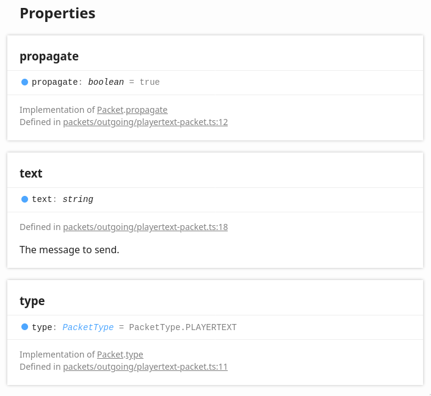

# Sending packets

Sending packets is an easy process, but is a bit more complex than using packet hooks. Unlike in packet hooks where we are simply given a packet, if we want to send a packet we are responsible for creating the packet, filling out its properties, and sending it.

Let's finish off the hello plugin by sending a reply to the PMs we receive. Firstly, we'll need to add a new import: the `PlayerTextPacket`.

```ts
// add PlayerTextPacket
import { Library, PacketHook, Client, TextPacket, PlayerTextPacket } from 'nrelay';
```

We can use the player text packet to send a message from our bot. We'll need to create a new instance of one in order to send it. We'll remove our console log while we're at it since it's no longer needed.

```ts
if (textPacket.recipient === client.playerData.name) {
  if (textPacket.text === 'hello') {
    const reply = new PlayerTextPacket();
  }
}
```

We need to fill out the properties of the packet before we can send the packet, so let's refer back to the packet docs again to see what is required.



We can see that the player text packet has 3 properties, however 2 of these properties can be ignored.

+ `propagate` - Used for packet control flow and is discussed later.
+ `type` - The type of the packet, this should not be changed.

These two properties are common to *all* packets. This means that the only property we have to change is the `text` property.

```ts
if (textPacket.text === 'hello') {
  const reply = new PlayerTextPacket();
  reply.text = `/tell ${textPacket.name} Hello!`;
}
```

Finally, we can send our packet by using the `io` property of the client.

```ts
if (textPacket.text === 'hello') {
  const reply = new PlayerTextPacket();
  reply.text = `/tell ${textPacket.name} Hello!`;

  client.io.send(reply);
}
```

With these final changes, the hello plugin is done! Once again we can build our project, and run the plugin.

There is no special console output for this final change since the exciting stuff happens entirely in game!

**Note:** If your bot is not replying to you, make sure your star filter is low enough to accomodate the bot.

## The complete code

At this stage, our code should look similar to the following:

```ts
import { Library, Client, PacketHook, TextPacket, PlayerTextPacket } from 'nrelay';

@Library({ name: 'Hello plugin', author: 'tcrane' })
class HelloPlugin {

  @PacketHook()
  onTextPacket(client: Client, textPacket: TextPacket) {
    if (textPacket.recipient === client.playerData.name) {
      if (textPacket.text === 'hello') {
        const reply = new PlayerTextPacket();
        reply.text = `/tell ${textPacket.name} Hello!`;

        client.io.send(reply);
      }
    }
  }

}
```

## The next step

At this point, we've achieved our goal. The hello plugin is done. If you're feeling adventurous, read on to the next chapter where we'll add more functionality to the hello plugin.
